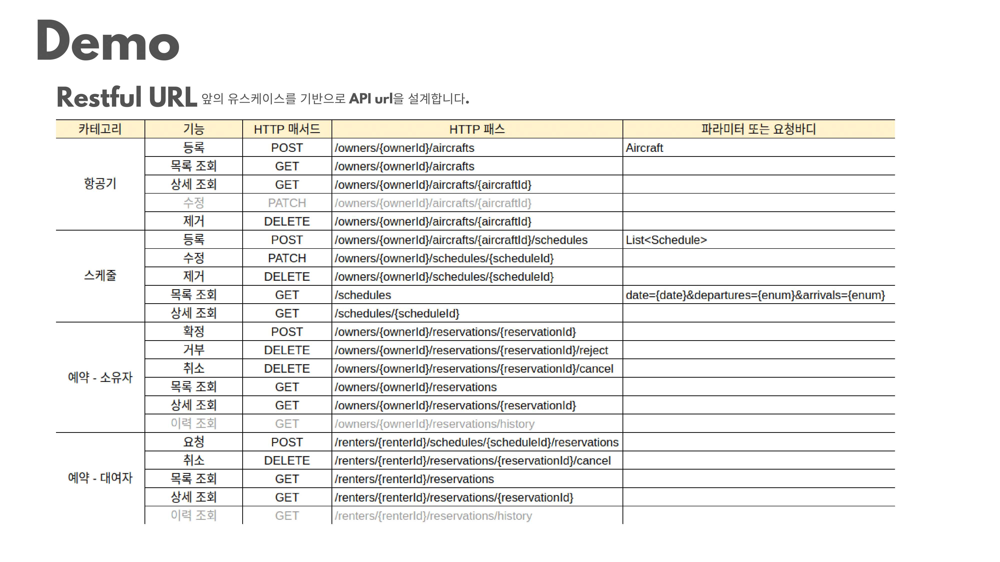
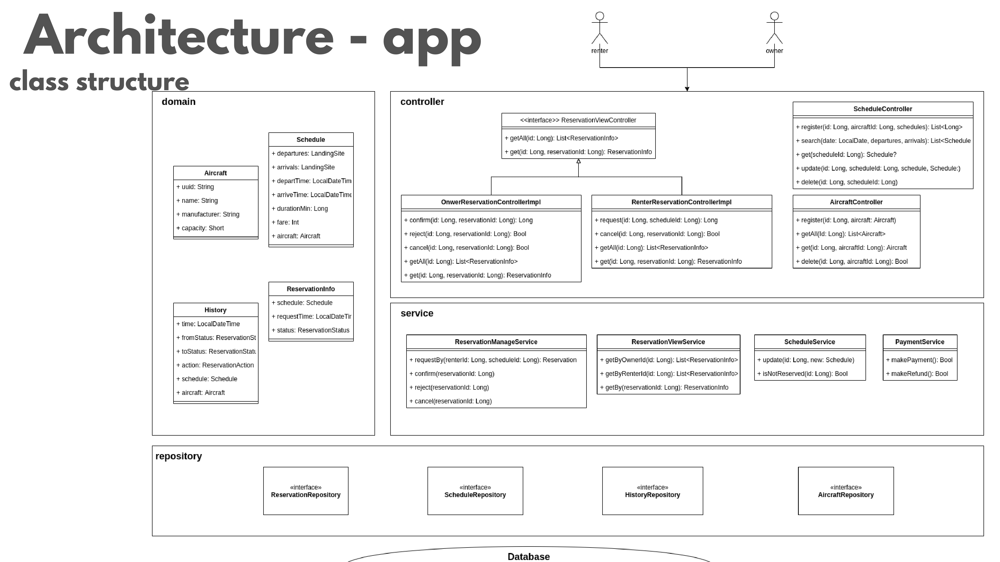
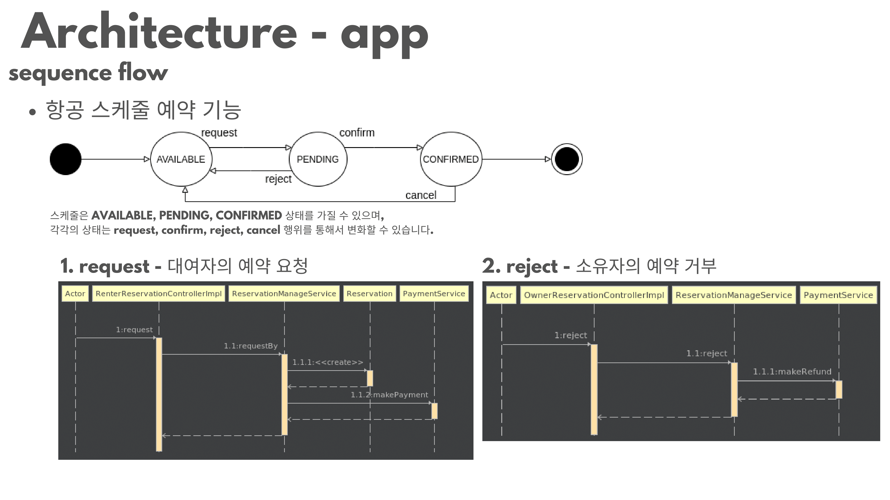
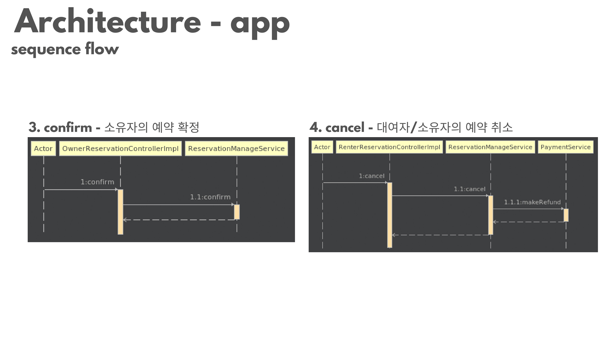

# 프로젝트 개요
해당 프로젝트는 30인 이하 소형 항공기를 단체 대여할 수 있는 시스템이다. 
시스템명은 `GetTA`이며, 해당 문서는 기획과 데모, 설계, 프로젝트 관리한 내용을 담고 있다.

## 1. 기획


## 2. 데모




## 3. 설계
### 1) 클래스 및 객체 설계



### 2) 데이터베이스 설계

### 3) 테스트 설계


## 3. 프로젝트 관리


---
# 개발 환경 설정
다음은 로컬 개발환경을 만들기 위한 설정들의 일련의 과정을 설명한다.
### 1) java 설치
1. sdkman 설치
   ```bash
   $ curl -s "https://get.sdkman.io" | bash
   $ source "$HOME/.sdkman/bin/sdkman-init.sh"
   $ sdk version
   ```
2. sdkman 에서 java corretto 17 설치
    ```bash
    $ sdk list java
    $ sdk install java ${java-version}
    ```
<br>

### 2) mysql 설치
1. [docker 설치](https://docs.docker.com/engine/install/)

2. docker-compose 설치
      ```bash
      $ sudo curl -L "https://github.com/docker/compose/releases/download/1.29.2/docker-compose-$(uname -s)-$(uname -m)" -o /usr/local/bin/docker-compose
      $ sudo chmod +x /usr/local/bin/docker-compose
      $ docker-compose --version
      ```
3. mysql 띄우기
    ```bash
    $ cd docker; docker-compose up -d
    ```